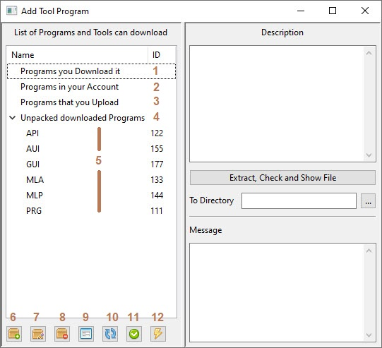
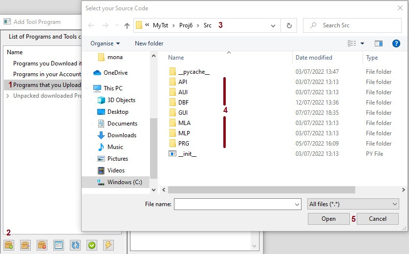
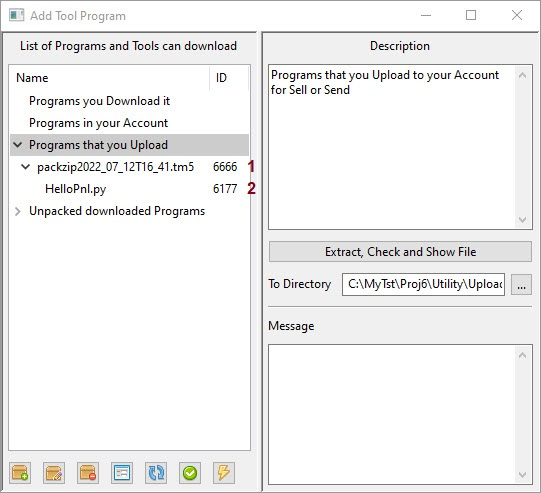
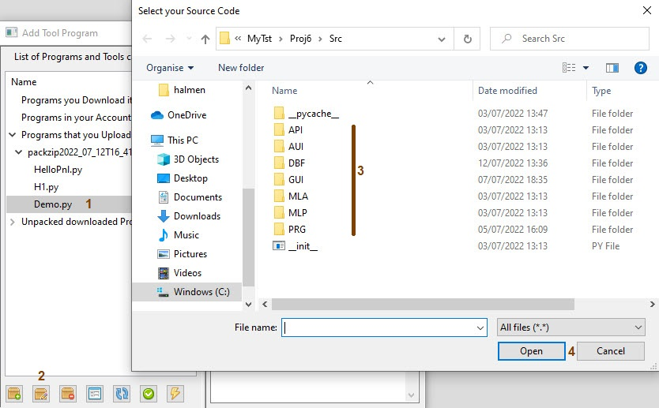
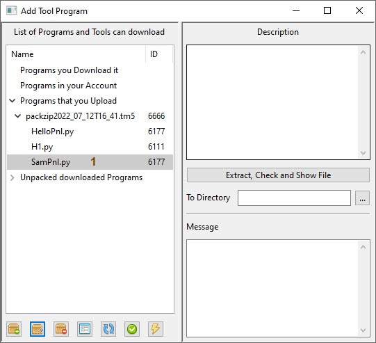
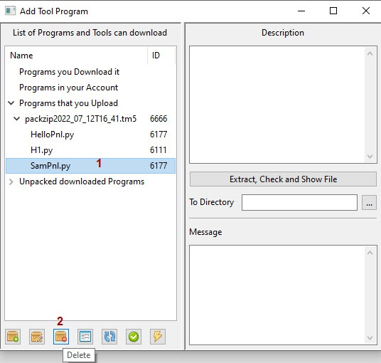
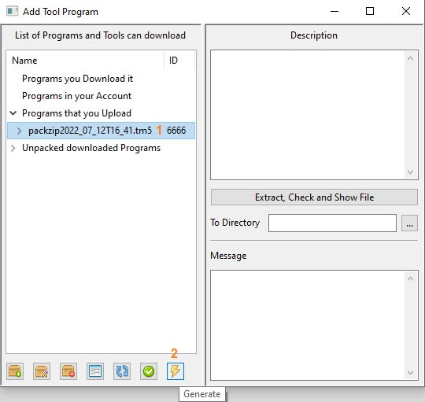
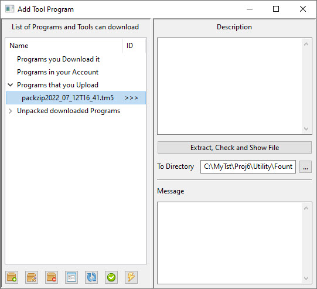
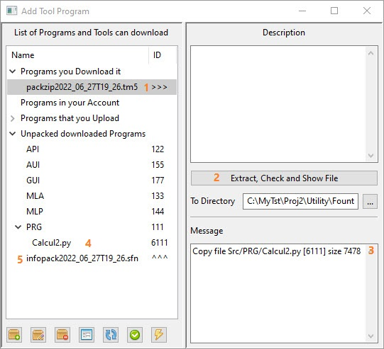

How to Use AddTool
==================

with Add Tool Program you can get a program from other person
also you can package your source code for other and upload in site
you can see program that download and unpacked it

1. if Download a pack with .tm5 extension put in ``Utility\Downloads`` path show here
2. Archive of Ziped file you unpack and  sended to ``Utility\Account`` path
3. You can Add your program source and create a Package in ``Utility\Upload`` path
4. When you Unpacking the download file they Open it at ``Utility\Fount`` path
5. Each programs panels machine learning algorithms and ... split in subdirectory
6. Add a program or file to package(for Upload to site)
7. Edit one of program or file in package
8. Delete one of program or file from package
9. view source of program that Unpacked in Fount subdirectory
10. refresh list in directories
11. Apply to send all unpacked program to Src directoru
12. Generate to create a package for Upload to site

> Note: Only file in ``Src Path`` can packed and send for upload 
> other files get an error or not work correctly  
> After Generate pack you can **NOT** change file in package 
> if you try outside of program this pack not use for other

----------------------------------------------------------------

How to Create a Package for Upload
----------------------------------

1. Select Upload list item
2. press Add package button
3. change path to Src in your project
4. find your program each Path geted automatic a code 
6. press a open button 

1. application automatic create a package
2. you can see list of program and path code

----------------------------------------------------------------

How to Edit List of Package
---------------------------

1. Select the item that you like to change
2. press Edit butoon
3. Choose your new source file
4. press Open button

1. you can see the changed file

>Note: after Generate you can not change or delete file in package

----------------------------------------------------------------

How to Delete from List of Package
----------------------------------

1. select the item
2. press Delete button

----------------------------------------------------------------

How to Generate Package
-----------------------
After Add all file to package,

1. Select package
2. press Generate button

the list refresh and package Create in ``Utility\Upload`` path
you can see the ID code like this '>>>'

>Note: After packing you can not change or add or delete file in it

----------------------------------------------------------------

How Extract a Download Package
------------------------------
When download or get a package, copy it in ``Utility\Downloads`` path  
if Refresh list with Refresh button you can see your file in list 

1. Select a Download file
2. press Extract, Check and Show File
3. In Message you see what files extract,Also Path, Code and Size
4. In Unpacked downloaded programs you can find programs
5. All Info of exteracted files is in this file

> All extract files code start with 61 and you can find in  
> Utility\Fount path But if you like to Use it in Application  
> you must do down action 

How Copy and Use Extracted Program
----------------------------------
