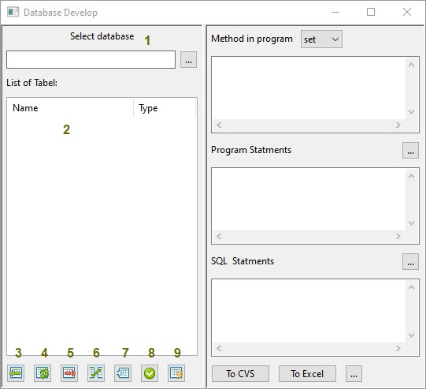
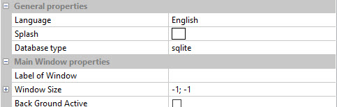
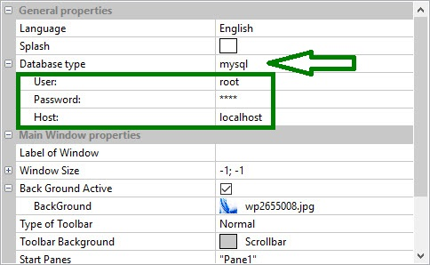
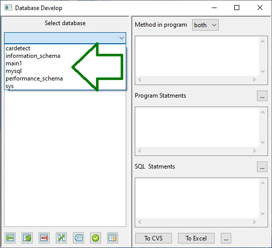
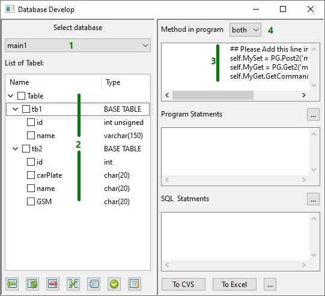
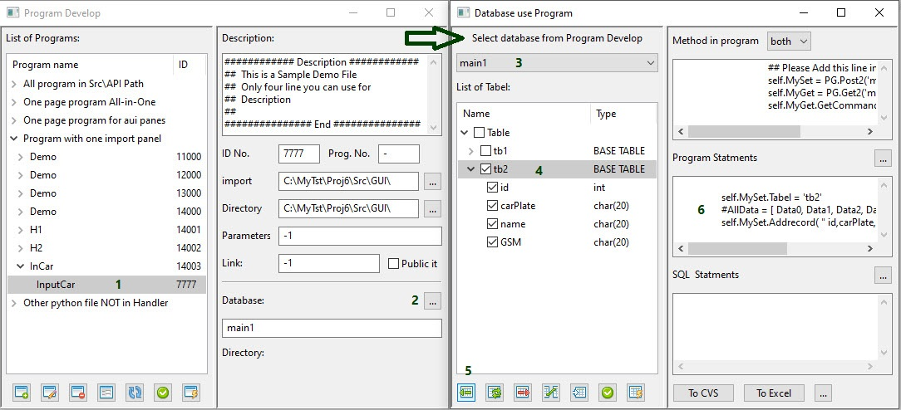
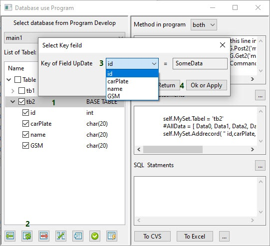
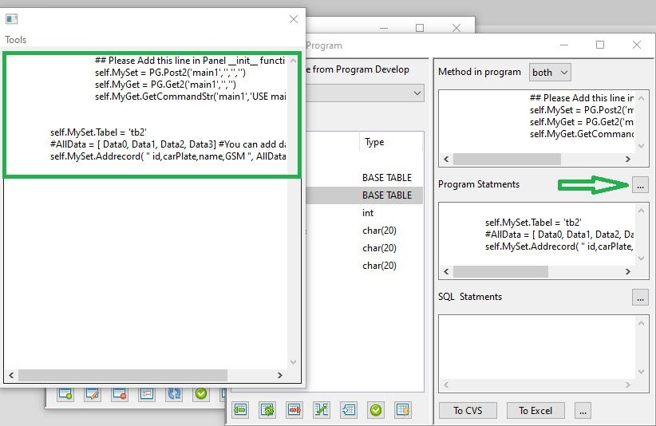
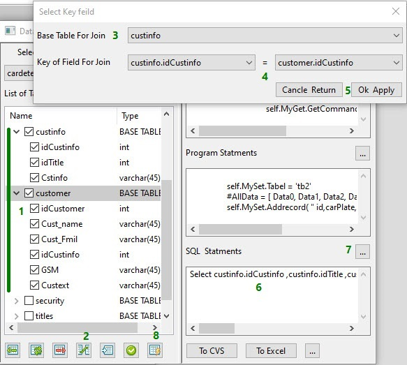

How Use Database in Programs
============================

Window Databse Develop
----------------------
In this window you can see how add code to program and access to database  
Also you can brows Table of Database and schema of each Table
you can export data to csv and excel file and use it in other part



if your database type is SQlite in setting:


1. choice database file
2. list of Tables
3. Insert to Table that select (Show in Program Statements)
4. Update Table that select (Show in Program Statements)
5. Delete Table that select (Show in Program Statements)
6. Join two or more Table that select (Show in SQL Statements)
7. Browse Table
8. apply to program
9. generate a SQL file

if your database type is other type in setting:



> note : you must enter User Password and Host then press apply  
> please attention to set correct information to join to database  
> application use a default port for connect database 



if connect have not any error You should see a choice menu instead of a file selection

How use Database in programs
----------------------------



1. Select Database(or open sqlite database)
2. you can see Tables and fields
3. This part must add to your program
4. you can use `Set` or `Get` or `Both`

> Note: If you open Database Develop from Program Develop
> program Automatic add this line to source of your python file

> if you used database in your python program you can see it in program develop in future 



1. Select program
2. If used you see or use new press [...]
3. System automatic show database
4. Select Table you like to use
5. press Insert button
6. see to line you must add to program 

> please attention to arrow when you open database from program

more detail about program [Here](Programs.md)

if press Update button:



1. Select Table you work with it
2. Press Update button
3. Choice Key field to filter data 
4. press OK or Apply button

> Same Do for Delete 



Arrow showing  button that you can press to see all statement you must enter in program file

> It is your responsibility to observe the distance between the tabs

How to Join two or More Table
-----------------------------



1. Select Tables you like join it
2. press Join button
3. Choice Base Table 
4. Choise Key of Field for Join
5. press Ok Apply to Create Statement SQL
6. You can see SQL Here
7. This button open your other SQL save file in Path Src\DBF\sqls
8. will Generate or Save SQL file into Src\DBF\sqls path 

> Note:  In Browse Table if you create or open join SQL seen the result
> but if that empty only seen selected Table  
> In Three Select Table you must attention to key field, the  first Table is a base Table


How get or set Data to Database
-------------------------------

If you attended to lines you can see this :

In import part 

```python
import Database.PostGet as PG
```

in __init__ function of Panel:
if sqlite:
```python
self.MySet = PG.Post2('Your\Path\of\Database','','','')
self.MyGet = PG.Get2('Your\Path\of\Database','','')
```
if MySql , Postgresql , ...:
```python
self.MySet = PG.Post2('YorDatabase','','','')
self.MyGet = PG.Get2('YorDatabase','','')
self.MyGet.GetCommandStr('YorDatabase','USE YorDatabase;')
```

for Insert add text under function is:
```python
self.MySet.Tabel = 'SelectTable' 
#AllData = [ Data0, Data1] #You can add data to put here
self.MySet.Addrecord( " field1,field2,... ", AllData )
```
> Note: When you select Fields in application will automatically add fields to text suggested

for Update add text under function is:
```python
self.MySet.Tabel = 'SelectTable' 
#AllData = [ Data0] #You can add data to put here
#self.KeyData = #can put need data here
self.MySet.Updaterecord( " field=?  Where keyfield = %s " %self.KeyData , AllData )
```

for Delete add text under function is:
```python
self.MySet.Tabel = 'SelectTable' 
#self.KeyData = #can put need data here
self.MySet.Deleterecord( " keyfield = %s " %self.KeyData ) 
```

for Query you can Use this text in function:
```python
AllData = self.MyGet.GetFromString("Select * from YourTable")
```

if to use SQL file please way this step:

the first use

```python
self.MyGet = PG.Get2('Your\Database\Path\DBfile.db','','SQLfile.sql')
```

then 

```python
sqlfiledata = self.MyGet.GetFromDbf()
```

for use the editor go [here](Editor.md)