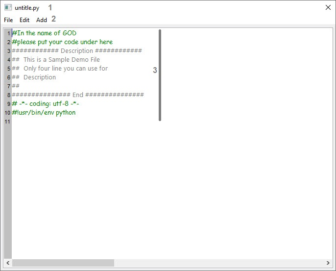
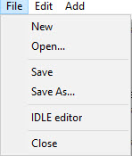
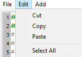
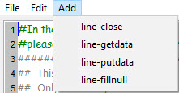

How to use python editor 
========================
The editor that we use is sample demo from wxpython
we added some menu to it for better use. but if your code is
professional, we suggestion to you useage other application 
and only use this program for see  your code 


1. File title, if change '*' add to name and path
2. menu to open save and edit file
3. Editor area for write code this lines are default


1. New        : show the default form, if you change anything you must save it
2. Open...    : open an exist file in your hard file must be a python file fromat
3. Save       : save your work if the title have a '*' in name text remove it
4. Save As    : save the this source to new name file 
5. IDLE editor: you can use python idle editor 
6. Close      : Exit editor


1. Cut        : cut a selected part of source
2. Copy       : copy a selected part of source to clipboard
3. Paste      : paste a source text in clipboard to cursur position
4. Select All : select all source text for copy or cut and ...



this menu use for some rotin code in Panel  
for example if you have this cod:

````python
# -*- coding: utf-8 -*-

###########################################################################
## Python code generated with wxFormBuilder (version Oct 26 2018)
## http://www.wxformbuilder.org/
##
## PLEASE DO *NOT* EDIT THIS FILE!
###########################################################################

import wx
import wx.xrc

###########################################################################
## Class MyPanel1
###########################################################################

class MyPanel1 ( wx.Panel ):

	def __init__( self, parent, id = wx.ID_ANY, pos = wx.DefaultPosition, size = wx.Size( 268,342 ), style = wx.TAB_TRAVERSAL, name = wx.EmptyString ):
		wx.Panel.__init__ ( self, parent, id = id, pos = pos, size = size, style = style, name = name )

		bSizer1 = wx.BoxSizer( wx.VERTICAL )

		bSizer2 = wx.BoxSizer( wx.HORIZONTAL )

		self.m_staticText3 = wx.StaticText( self, wx.ID_ANY, u"Sample Panel", wx.DefaultPosition, wx.DefaultSize, 0 )
		self.m_staticText3.Wrap( -1 )

		self.m_staticText3.SetFont( wx.Font( 25, wx.FONTFAMILY_DEFAULT, wx.FONTSTYLE_NORMAL, wx.FONTWEIGHT_NORMAL, False, wx.EmptyString ) )

		bSizer2.Add( self.m_staticText3, 1, wx.ALIGN_CENTER_VERTICAL|wx.ALL, 5 )


		bSizer1.Add( bSizer2, 0, wx.ALIGN_CENTER_HORIZONTAL, 5 )

		bSizer3 = wx.BoxSizer( wx.HORIZONTAL )

		wSizer1 = wx.WrapSizer( wx.VERTICAL, wx.WRAPSIZER_DEFAULT_FLAGS )

		self.m_checkBox1 = wx.CheckBox( self, wx.ID_ANY, u"Check Box1", wx.DefaultPosition, wx.DefaultSize, 0 )
		wSizer1.Add( self.m_checkBox1, 0, wx.ALL|wx.ALIGN_CENTER_VERTICAL|wx.ALIGN_CENTER_HORIZONTAL, 5 )

		self.m_checkBox2 = wx.CheckBox( self, wx.ID_ANY, u"Check Box2", wx.DefaultPosition, wx.DefaultSize, 0 )
		wSizer1.Add( self.m_checkBox2, 0, wx.ALL, 5 )

		self.m_checkBox3 = wx.CheckBox( self, wx.ID_ANY, u"Check Box3", wx.DefaultPosition, wx.DefaultSize, 0 )
		wSizer1.Add( self.m_checkBox3, 0, wx.ALL, 5 )


		bSizer3.Add( wSizer1, 1, wx.ALIGN_CENTER_VERTICAL, 5 )

		wSizer3 = wx.WrapSizer( wx.VERTICAL, wx.WRAPSIZER_DEFAULT_FLAGS )

		self.m_radioBtn1 = wx.RadioButton( self, wx.ID_ANY, u"RadioBtn1", wx.DefaultPosition, wx.DefaultSize, 0 )
		wSizer3.Add( self.m_radioBtn1, 0, wx.ALL|wx.ALIGN_CENTER_HORIZONTAL|wx.ALIGN_CENTER_VERTICAL, 5 )

		self.m_radioBtn2 = wx.RadioButton( self, wx.ID_ANY, u"RadioBtn2", wx.DefaultPosition, wx.DefaultSize, 0 )
		wSizer3.Add( self.m_radioBtn2, 0, wx.ALL|wx.ALIGN_CENTER_HORIZONTAL|wx.ALIGN_CENTER_VERTICAL, 5 )

		self.m_radioBtn3 = wx.RadioButton( self, wx.ID_ANY, u"RadioBtn3", wx.DefaultPosition, wx.DefaultSize, 0 )
		wSizer3.Add( self.m_radioBtn3, 0, wx.ALL, 5 )


		bSizer3.Add( wSizer3, 1, wx.ALIGN_CENTER_VERTICAL, 5 )


		bSizer1.Add( bSizer3, 1, wx.EXPAND, 5 )

		bSizer4 = wx.BoxSizer( wx.VERTICAL )

		self.m_staticText1 = wx.StaticText( self, wx.ID_ANY, u"Text Control", wx.DefaultPosition, wx.DefaultSize, 0 )
		self.m_staticText1.Wrap( -1 )

		bSizer4.Add( self.m_staticText1, 0, wx.ALL|wx.ALIGN_CENTER_VERTICAL|wx.ALIGN_CENTER_HORIZONTAL, 5 )

		self.m_textCtrl1 = wx.TextCtrl( self, wx.ID_ANY, wx.EmptyString, wx.DefaultPosition, wx.DefaultSize, 0 )
		bSizer4.Add( self.m_textCtrl1, 0, wx.EXPAND, 5 )

		self.m_staticText2 = wx.StaticText( self, wx.ID_ANY, u"Choise", wx.DefaultPosition, wx.DefaultSize, 0 )
		self.m_staticText2.Wrap( -1 )

		bSizer4.Add( self.m_staticText2, 0, wx.ALL|wx.ALIGN_CENTER_HORIZONTAL|wx.ALIGN_CENTER_VERTICAL, 5 )

		m_choice1Choices = []
		self.m_choice1 = wx.Choice( self, wx.ID_ANY, wx.DefaultPosition, wx.DefaultSize, m_choice1Choices, 0 )
		self.m_choice1.SetSelection( 0 )
		bSizer4.Add( self.m_choice1, 0, wx.ALL|wx.EXPAND, 5 )


		bSizer1.Add( bSizer4, 1, wx.EXPAND, 5 )

		sbSizer1 = wx.StaticBoxSizer( wx.StaticBox( self, wx.ID_ANY, u"Buttons" ), wx.HORIZONTAL )

		self.m_button1 = wx.Button( sbSizer1.GetStaticBox(), wx.ID_ANY, u"MyButton1", wx.DefaultPosition, wx.DefaultSize, 0 )
		sbSizer1.Add( self.m_button1, 1, wx.ALL, 5 )

		self.m_button2 = wx.Button( sbSizer1.GetStaticBox(), wx.ID_ANY, u"MyButton2", wx.DefaultPosition, wx.DefaultSize, 0 )
		sbSizer1.Add( self.m_button2, 1, wx.ALL, 5 )


		bSizer1.Add( sbSizer1, 0, wx.EXPAND, 5 )


		self.SetSizer( bSizer1 )
		self.Layout()

		# Connect Events
		self.m_button1.Bind( wx.EVT_BUTTON, self.exit )
		self.m_button2.Bind( wx.EVT_BUTTON, self.doit )

	def __del__( self ):
		pass


	# Virtual event handlers, overide them in your derived class
	def exit( self, event ):
		event.Skip()

	def doit( self, event ):
		event.Skip()
````
Add menu action in this type:
1. line-close    : add this line for close panel if you work on wx.Panel class
````python
def exit( self, event ):
	q = self.GetParent()
	q.Close()

	event.Skip()
````
>code automatice add tab to line 
2. line-getdata  : if you use ``wx.TextCtrl,wx.Choice,wx.CheckBox,wx.RadioBox``  
application listed they and write code same as this:
````python
def GetData( self ): # your own function
	D1 = self.m_textCtrl1.GetValue()
	D2 = self.m_choice1.GetSelection()
	D3 = self.m_checkBox1.GetValue()
	D4 = self.m_checkBox2.GetValue()
	D5 = self.m_checkBox3.GetValue()
	D6 = self.m_radioBtn1.GetValue()
	D7 = self.m_radioBtn2.GetValue()
	D8 = self.m_radioBtn3.GetValue()
	#### you can return data in your own format here ###
````
3. line-putdata   : same getdata application add with tab same as this code:
````python
def PutData( self, Data ): # your own function
	#Data = [] #Put your data in list or use at argumant in function
	self.m_textCtrl1.SetValue( Data[1] )
	self.m_choice1.SetSelection( Data[2] )
	self.m_checkBox1.SetValue( Data[3] )
	self.m_checkBox2.SetValue( Data[4] )
	self.m_checkBox3.SetValue( Data[5] )
	self.m_radioBtn1.SetValue( Data[6] )
	self.m_radioBtn2.SetValue( Data[7] )
	self.m_radioBtn3.SetValue( Data[8] )
````
4. line-fillnull   : add this line to your code:
````python
def NullData( self ): # your own function
	#Data = [u'',u'',...] #Put empty data in list
	#self.PutData( Data ) #Send empty data to Put Data Function
````

application automatice search wx.TextCtrl wx.CheckBox and ...  
also if you like to add data to database go to [here](Databases.md)

Editor also use in Machine Learning part  
in MLA Design the menu Add in Editor change to other item

