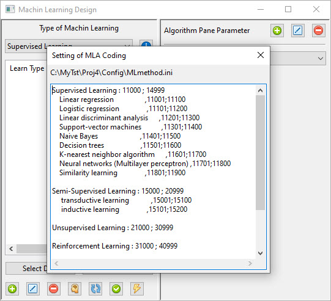

How to Use Machine Learning in Application
==========================================

Machine Learning have two part and in each you can use source code 
1. Algorithm Part, that you can use scripts and programs to comput mamthmatic formula
2. In Panel Part that you can design it for define or change parameter, show plot, set data and ...

each part have a special path to get source file in it 
MLA in Src Path for Algorithm and MLP for Panel.  
you can also change Classification of Algorithm codes you can see it in MLmethod.ini file  

for Example if your code is between 11701 and 11800
all program set under Neural Network(Multilayer per...)

How Add Algorithm or Model 
--------------------------

1. Type of Machine Learning
2. List of Algorithm and Method you have
3. This Button Add Dataset to your Algorithm Panel
4. This part work in future
5. Add new Method and Algorithm file
6. Edit a select file in list
7. delete a select file from list
8. Test your Learning Training
9. refresh list
10. apply the file not in list
11. generate the panel not in panel list

if press Add button you see this Editor window

in Add menubar you can add import Numpy , matplatelib and Axes 3D to program

if press Edit Button you see the file that selected

if press Delete Button you can delete selected file

Algorithm Panel Parameter
-------------------------

1. Add new Panel Parameter
2. Edit Panel
3. Deleted Panel 
4. Choice a Panel (Page change )
5. Generate Panel in Hard Disk not in list
6. Do Start function in Panel source
7. Do Test function in Panel source

All file is in Src\MLP path

if press Add button set this window

> Note: Class P19( wx.Panel) must Not change
> you can add object under Hsz wx.HORIZONTAL boxsizer

you can change Start and Test function for 6 and 7

if press Edit you can see source of file

if press Delete Panel remove from list 
you can see that file in All MLA source file in HDD

> Note: The file Method have '????' is in MLA
> the file Method have '****' is in MLP
> if Panel file have NOT import Src.MLA.YourMLA
> can not add to Panel Parameter list

if in All MLA source file in HDD you like to add a file to list

1. Name that appearance in list
2. alg id (you can find it in Setting of MLA Coding)
3. abbr. name of Algorithm like NN i.e. Neural Network
4. This file that you select to add to list
5. Apply or Cancel work

