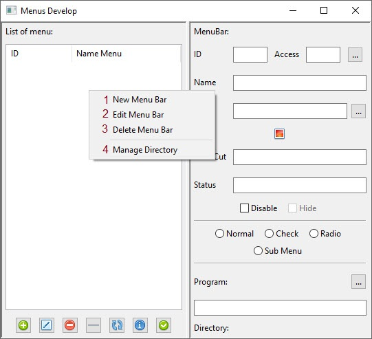
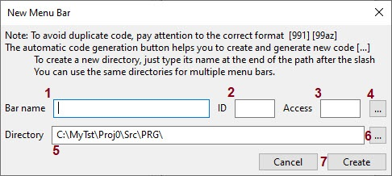
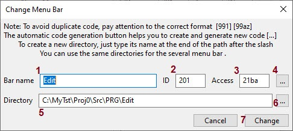
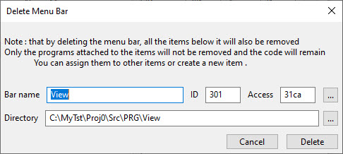
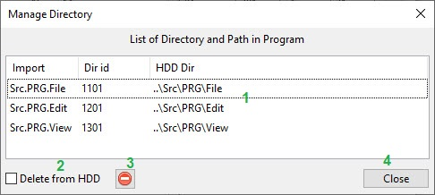

How Create menubar
=====================
After right-clicking a mouse, a menu will appear in the menu list

 1. Create a New MenuBar
 2. Edit an exist MenuBar in List of menu
 3. Delete an exist MenuBar at List of menu
 4. View and delete directories on the hard drive connected to the MenuBar

------------------------------------------------------------------

Create a New MenuBar
--------------------

 1. Menu Bar name
 2. ID code in range 101-991
 3. this code for access user define
 4. Code Generation Automatic
 5. Path of program for All item in Menu Bar
 6. Browse Path that exist
 7. Create or Cancel button 

> Note: last number of code must always be 1.
> > The code difference between the two menus determines the number of items that can be created  
  > for Example : code 101 and 201 in MenuBar have 988 item  
  > If the code of the first menu item is 1011, the code of the last item can be 1999.  
  > The next item in the menu bar starts from the 2011 code.  
  > The separator also needs the code and you have to count it.

If you type a directory at the bottom of the **Directory Path field** and it does not exist in that path, 
the program will automatically create it and create a ``Demo.py`` file in it. 
Also, if ``SamPnl.py`` does not exist in the **Src\GUI** path, It also creates.

> Note: All menu items are linked to the created or selected directory, and the menu items only use that directory
> Therefore, it is better to use a separate directory for each menu bar. However, menu bars can use a shared directory.

---------------------------------------------------------------------------------------------------

Edit a Menu Bar
---------------

1. You can Edit or Change you Menu Bar name
2. you can **NOT** Change ID code
3. also can **NOT** change Access code
4. This item **NOT** work here
5. you can change or create new directory
6. you can Browse and select a directory
7. Change or Cancel button

> Note that if you change the directory and the menu items are linked to another directory, they may crash
Make sure the items point in the right direction before changing.

---------------------------------------------------------------------------------------------------

Delete a Menu Bar
-----------------

All item in windows only for information about menu Bar that you like to delete it  
All menu item and submenu of this Menu Bar Also will Delete  
Only Programs and Directory remain for use in future  
if you like Delete programs or directory please see the [List of Program](Programs.md) Part  

---------------------------------------------------------------------------------------------------

Manage Directory
----------------

1. List of Directory that Application Use
2. if check this item Directory ***remove*** from your Hard Disk
3. Delete Directory from List
4. Close Window button

> Note: if your Menu Bar of this Directory is exist you can **NOT** delete it  
> if program is in directory Please first go to List of Program Part
