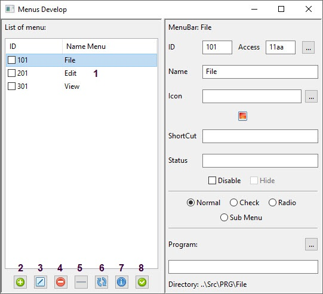
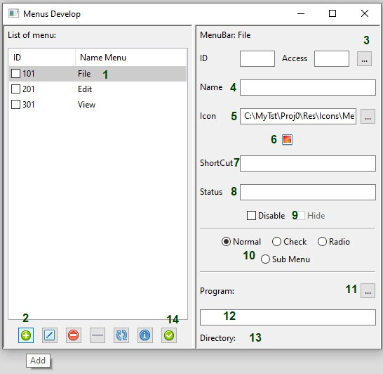
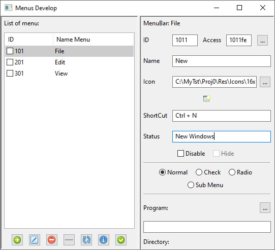
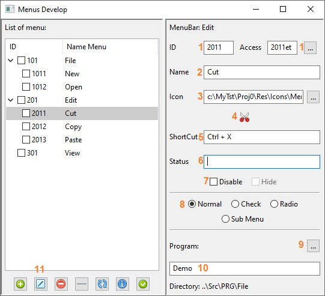
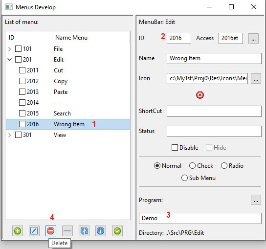
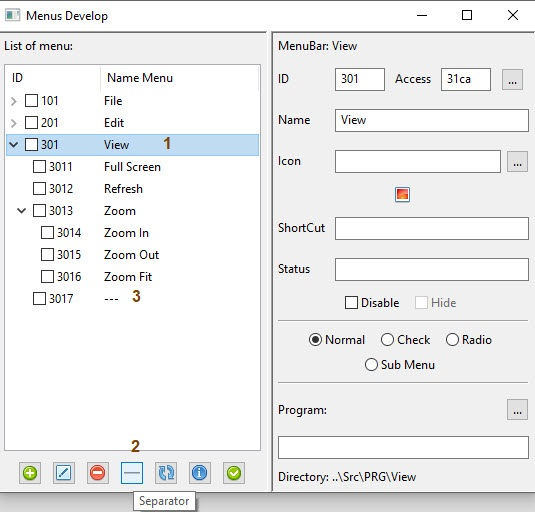

How Create A Menu Item
======================

after Define Menu Bars you can Add menu Item to application



1. List of Menu Bar with out any item
2. Add item 
3. Edit item
4. Delete item
5. Separator
6. Update List
7. Information
8. Apply Add item

> Note:
> Apply button only use for Add item  
> Separator button add last code select + 1 in Menu bar

Add Menu Item
--------



1. first Select a MenuBar
2. press Add button
3. press Generat Automatic button 
4. Item name you like 
5. Path of Icon
6. You can see Icon
7. ShortCut Exm. ``Ctrl + A``
8. Status or Help show in status bar
9. Disable item - Hide item
10. type of Menu Item
11. Link to List of Program 
12. name of Program that item use it
13. Directory of item that program in it
14. Aplly if fill the necessary information

> Note: All item after 5 can fill later   
> if you like to create a submenu please select it  
> you can change ID code or Access Before apply But   
> after create menuitem you can **NOT** change them  
> Please be careful about your information then press Apply

if you blank **No. 12** (name of program), application will select ``Demo.py`` for this item automatically.    
you can change this program for this menu item later but that must exist in this directory.  
Icon Size is 16x16 and default Path is ``Res\Icons\Menu`` if you select other path application copy it in this path  
if select Checkable or Radio Icon NOT useable for menu item better not use it    
for select SubMenu refer to [SubMenu](SubMenu.md) Create Document  


--------------------------------------------------------------------------------------------

Edit Menu Item
--------------
after select a menu item in the list of menu you can change or add other information to item


1. You can **NOT** Change ID or Access or Use Generate Code Automatic button
2. You can change Name of menu item
3. You can change Icon (Not path only Icon)
4. See Item Icon if change it
5. You can Add ShortCut or Change it
6. You can Add or Change Status text
7. You can Disable or Enable Menu Item 
8. You can Change type of menu item
  > Note: if you change to Sub Menu you must close application and then open it again  
> if you Use Icon for Item better delete Icon for change to Checkable or Radio Item 
9. open List of Program to change a program
10. you can see the current program here
11. press Edit button to change menu item  

------------------------------------------------------------------------------------------------

Delete Menu Item
----------------


1. Select Item you like to delete
2. Note the item number as well as the menu bar
3. Program will **NOT** Delete. All action is in [List of Programs](Programs.md)
4. After press the button item will delete

Add Separator
-------------


1. Select Menu Bar (or Submenu) that you like to add Separator
2. Press one time Separator button then open tree list
3. you must see last item and last code that add to list

> Note: if you have Submenu please add all item in Sub then add remain items  


Update List
-----------
Refreshes all menu items, if the list is open, will close it and fill in all items again

Information
-----------
Print All Menu Item to Console ```(windows "wxPython stdout/stdio")```
> Note: All error or print in program show in this window

