How to Create a Pane
====================
You can define Pane and information of it in application 
also You can specify which page is displayed at the beginning of the application
all design file save in ``Src\AUI`` 
if you create first panel ``tempane.py`` will be copy automatic in this path

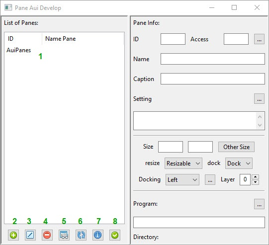

1. List of all Panes define in application
2. Add a new Pane 
3. Edit a Pane info
4. delete a Pane from application
5. show preview of Pane
6. Refresh List and changes
7. print information of a Pane
8. Apply add new pane 

How to Add a New Pane
---------------------

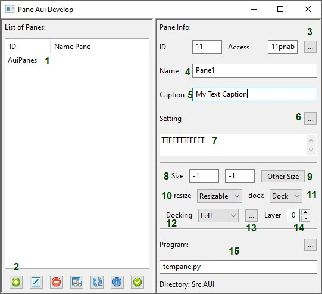

1. Here you can see list of Pane in application
2. press Add button to ready to start
3. press code generator to generate ID and access code
4. you must fill the name of Pane
5. if you like have a title top of pane windows fill here
6. you can setting some info for pane

   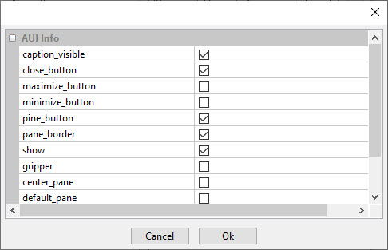
   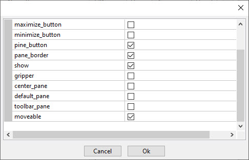

7. A string of Ts and Fs indicate your choice in the settings
8. if Pane moveable this is default size of pane's window
9. other size of pane here you can set

    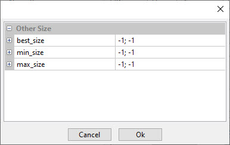

10. your pane also can Resizable or Fixed

   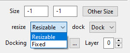

11. Pane can Dock or Float

   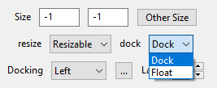

12. Also in which direction the program should be placed

   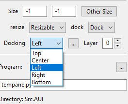

13. Other setting and properties

   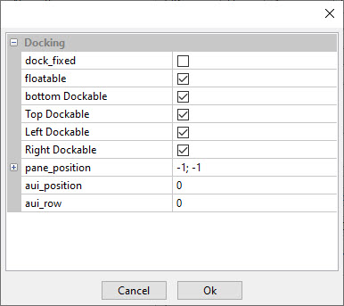

14. and setting of Layer 
15. in this part is the source and program that Pane use it
16. In last press Apply button

> in default ``tempane.py`` is the file that pane use but you can change it 
> with list of program end with edit button  
> if you use the center pane in Docking choice list please disable Background picture  
> in Setting because both part is in center of application and conflict together

---------------------------------------------------------------

How Edit a Pane
---------------

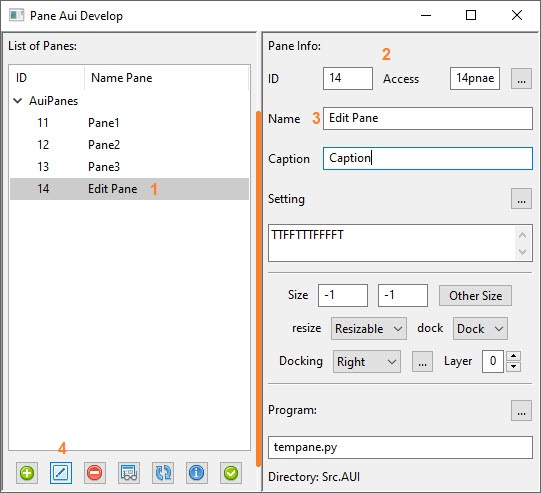

1. Select a pane in list
2. you can **NOT** change ID code or access
3. All other info parameter can change
4. press Edit button

---------------------------------------------------------------

How Delete a Pane
-----------------

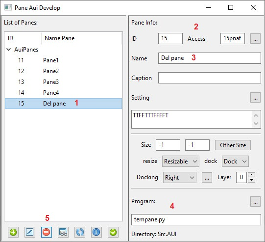

1. Select a pane in list
2. Attention to ID code and Access
3. If use in start (in setting) deselect it
4. you can **NOT** delete python file only in list of program
5. press Delete button to delete pane

---------------------------------------------------------------

How Preview a Pane
------------------

select a Pane
if you press Preview button you can see Pane in window  

---------------------------------------------------------------

Refresh the List
----------------
this button will Refresh the list of Panes in Application

---------------------------------------------------------------

Get Info
---------
this button will print data of this pane in to ``stdout/stderr window``

---------------------------------------------------------------

Show in Start
-------------
In [Settings](Setting.md) you can choose which Pane shown in start window
if you make a new pane the list is updated automatically

---------------------------------------------------------------

How Coded Pane
--------------
in List of program button in each window you can see the Code  
Please reference to [List of program](Programs.md)