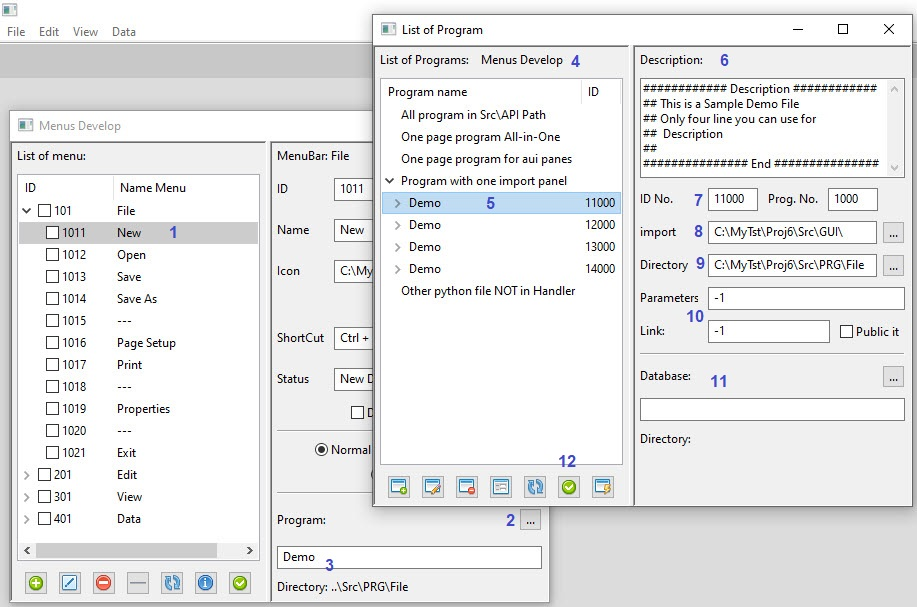
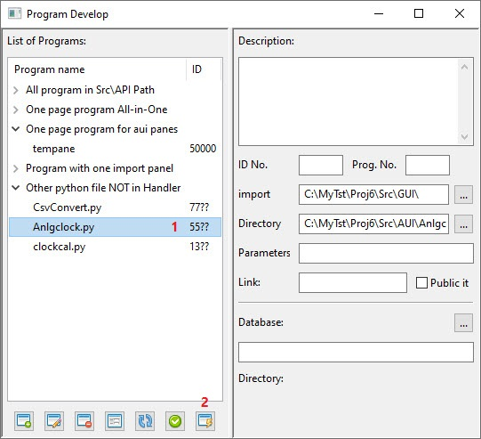

How to Work Programs and Codes
===========================

If you execute from menu you can not connect any program to any menuitem or toolbar item ,
But if you execute it from Menus Develop or Tool Bar Develop or Panes 
you can see program that connect to item and can change program.
Only one time you can execute this window from Develops part 

> Note:  
if field program was empty in Menu Develop or Toolbar Develop , list of program **NOT** work.  
if you wrote a mistake program or name had error, please type ``Demo`` in field and then press __Edit__ Button.

Orginal window is this:


1. All file in ``Src\API`` path show here. this script maybe import with other script
2. if file have a main function and GUI frame and panel inside it will show here
3. all AUI Panes source code or Panel with code start 5 number will show here
4. main program of menu and toolbar placed in Path ``Src\PRG`` will show here
5. other file that not in handler but exist in ``PRG AUI GUI`` path will show here 
6. Add a new program, Editor window will open
7. If select a item you can open and Edit it 
8. delete item from list or handler also you can delete from hardDisk
9. you can preview item that connect to menu or toolbar
10. refresh and update the list
11. if you come from menu or toolbar or pane , apply to select program for that part
12. generat a source that not in handler 

----------------------------------------------------------------

When you come from Menu Develop window:



1. Select your menu that to change or see its program
2. press button to appearance List of Program
3. if attend to file name and path and exist file in list automatic will select it
4. in the top of window writed which program open it
5. file selected and code start at 11000+
6. if file have a Desciription will show here
7. ID number and program number (number is The last four digits of the ID )
8. The path of the import file used
9. The path of file
10. this part is not work now (We predicted for the future )
11. if program use database show here

-----------------------------------------------------------------

How Add a new Program
---------------------

There is 2 way to add or change a program of one item:
1. Create a New Python File then Generate it 
2. Add program from Add Tools window

after select a menu item and press program button:
if you press Add button in this window you can write your code


1. f you save the file, the path of the new file will be replaced
2. with this menu you can open save and edit file
3. if like to add description about your program use this part

> Note: Only 4 line and in that form you can use from Description
> if you change structure may be have an error in output\error window

if you like to more help about Editor go [here](Editor.md)

After wirte your code and save it please refresh list to add program to list (No. 5)
Then press Generate button to make handler in database  
if program have this part: 
 ````python 
if __name__=='__main__':
       main()
 ````
and main function exist in code like this:
````python
def main( panel = None ):
    #other code under here
    parent =  panel.GetParent()
    pass
````
your code put in All-in-One part (No.2)
But if you have ```` wx.Frame ```` in your code and import file in this path:
````python
import Src.GUI.your_gui_file as your_abbr_name
````
then program add to part No.4 and show import file

>if your GUI file note exist your code have an error 
> and program not run correct 
> also all GUI file is in **Src\GUI** path put your file in this path  
> The **Src\API** path is for other import file that not have panel 
> and only for compute or define your class and ...

if your code have a statement like this:
````python
class MyPanel1 ( wx.Panel ):
	def __init__( self, parent, id = wx.ID_ANY, pos = wx.DefaultPosition, size = wx.Size( 500,300 ), style = wx.TAB_TRAVERSAL, name = wx.EmptyString ):
		wx.Panel.__init__ ( self, parent, id = id, pos = pos, size = size, style = style, name = name )
        #and other code under here
````
and not and other part in code when you press Generate code this window dialog shown
for choise your Path and type :


1. If you like a Frame for this Panel write name of this program here
2. select path of program you like to add it
3. If press Ok button Generate a file to your choise path

> Note: Please not use space character in your name file  
> the Path is link to menubar then Please first define you Menubar or Toolbar  
> you can **NOT** add other menu item in other menubar to this Path then please attend to your choice

for help about add program from AddTool go [Here](AddTool.md)

-----------------------------------------------------------------

How to Edit a Program
---------------------


if select a file you can edit it also you can open several windows

> Note: this Editor is sample and not good for code write
> if you like to write professional coding please use other application

you can see more help about editor [here](Editor.md)

How to Delete a program
-----------------------

. if press delete button program delete from handler list in database  
. if file in unlisted handler program (No.5) and you delete it file remove from hard disk

How to preview a program
------------------------

if you select a item and press preview button you can see it in sample frame  

> Note: only file that have GUI show in preview otherwise you have an error
> if error in files (main or import file) stdout/stderror windows show it
> you can debuge your code to see your error in this window

Refresh the List
----------------

if press refresh button your list and new program add to list

---------------------------------------------------------------

Apply Button
------------
if you select a program and press apply button you back to window that come from it  
for example:


1. Select Menuitem
2. press List Program button

> Attended to Path , Program must be here


3. Choice you program in list
4. press Apply button

> Attended to Directory that in correct path


5. your program must appear here
6. press Edit button to Change item program

if your program be correct it must work good

---------------------------------------------------------------

How Generate a Program
----------------------

if you have some source file that NOT use in application you can 
Generate it for use  
In Other python file NOT in Handler list you can find this files
that is ended ID's code with '??'

if your file in Src\AUI path:



1. you see '55??' code in ID column
2. if press generate button program automatic add to list


if your file in Src\API path you can see program in ``All program in Src\API Path``

> may be you can run program with preview button
> but this is not certain

If your program do not have GUI and main function in it you
can see it in ``One page program All-in-One``


> in main function you must use panel=None as argument 

if your program in GUI and like to make New Program for it:


1. Select a program that ID number is 77??
2. press Generate button
3. write your abbr name you like 
4. choice your path that program create in it then press ok button

> before create program be sure the correct path choice  
> if ``class MyPanel1 ( wx.Panel )`` **NOT** in file, you can not generate it 
> you can Edit new generate file , But Do it very carefully without change main function

