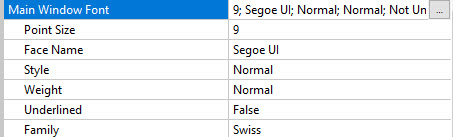

How Setting the Application
===========================

In this windows you can set:

1. Language
2. If choice image for Splash show in start
3. Choice Database Type 
4. Name of Main window Show at corner top left of window
5. Size of Main Window -1,-1 is Default
6. If Back Ground Active you can Choice an image for Background of main window
7. Type of ToolBar Normal or Aui
8. Color of Toolbar
9. If you have Panes you can Select which one start
10. Main Window Font
11. Show path date and time in status bar
12. color of status

Language
--------

the file MPT5en.po in Locale path is for language 
By translate and create this file Develop windows language change

> Note: If like to Use your font or language in application not need to 
> translate this file 
> If you like Add your language to Application that Not in List Please 
> send Us your language and translate file for we Update Project

Splash
------
We make in Resource path `Res\Splash` for your Images

Database Type
-------------

If you select mysql, postgresql, oracle You must Add 
User Password and Host to setting

> Note: Port is Default for each type But if you like to change it
> you must send us your request for update application for it

for more info go [Here](Databases.md)

Label Window
------------
the name of main window is `main` but you can change Label of main window

Size
----
Default size in setting is -1,-1 for wight and height
But you can change it in value you like
application get your maximum of display resulation and use it

Background
----------
If check Back Ground Active New row open and you can choice image for background
we make Images and Pics in Resource Path for this not any different between them

> Note: if you like to add or create a center pane this option creates a mess  
> if you are at the first time must apply setting and start application again to see background  
> at next time if change background seen change in a moment

Toolbar Type
------------

you can change type of toolbar from normal to Aui
after restart application set apply to main window

> Aui type can change to Horizontal and Vertical
> But Normal type is only in Horizontal form

Toolbar Background
------------------
with change choice menu you can see 

> Custom color NOT work  
> Icon of toolbar in Res\Icons\Toolbar path  and best size is 32x32
> But you can use larger size It responsibility with you

StartPane
---------
If you create Panes in Panes Develop you see the list of it here
You can choice which one start it application 
for more about Panes go [Here](Panes.md)

Font
----

with choice font the main window font will change
you can see effect it in status bar

Show in Status
--------------

you can show path , date and time in status bar

> if you like more option in this part Please Email us

Status Background
-----------------

like Toolbar you can change color of this part

