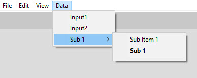

How to Create a SubMenu
=======================

For Create a Sub Menu You must action 2 step 
1. Add a Sub Menu Item
2. Add Menu Item for this Sub Menu

> Note: Only two level Sub Menu you can Create, more level will have an error

1. Select a MenuBar
2. press Add button 
3. press Code Generator button
 > Please pay attention to the arrow
4. Select Sub menu radio button
5. Fill other information you like
6. press Apply button

after Create Sub Menu go to next step

1. Select a Sub Menu Item
2. press Add button
3. press Code Generator button
 > Please pay attention to the arrow
4. Fill other information you like
5. for default the Normal type selected you can change it
6. press Apply button

after create you can see this

after restart application menu will change to correct position  
and Bold Name disappearing

Other commands like edit and delete is active for Sub Menu Item too

> Note: If you change Menu Item type from Normal ,Check or Radio to Sub Menu You must Close Application    
> After reopen application you can continue your work
