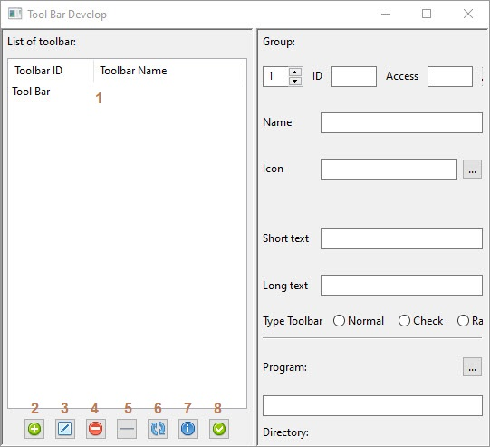
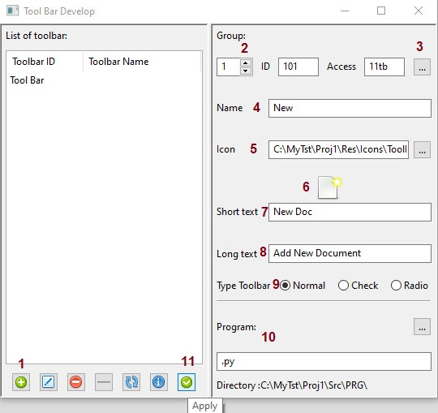
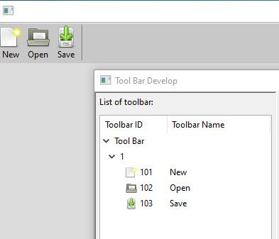
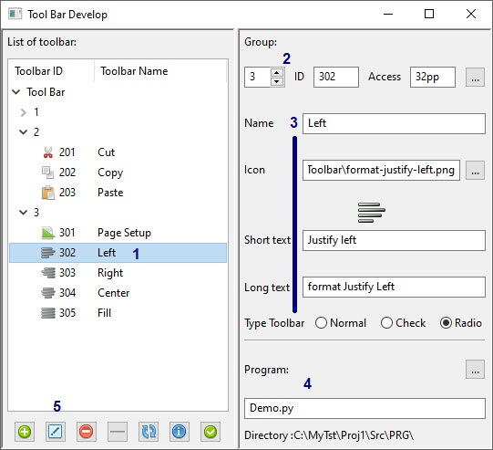
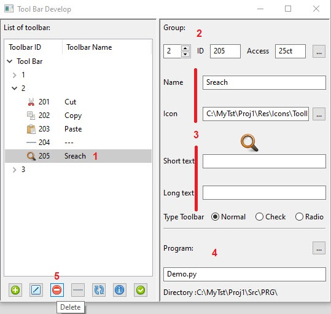
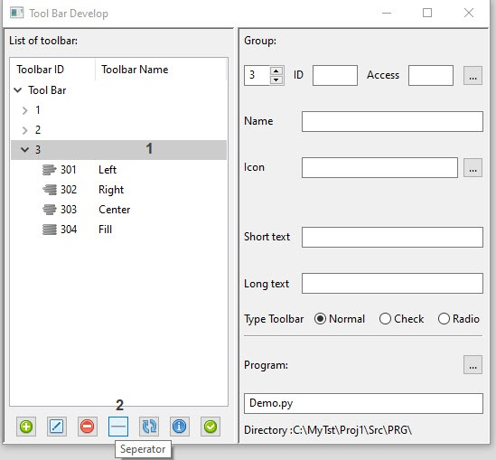
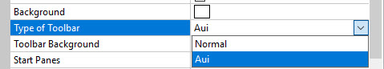
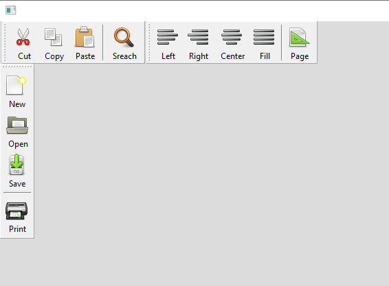

How to Create ToolBar
=====================

you can change type of toolbar and background color in setting  
also toolbar Icon size is 32x32 pixel  
if select Icon in other Path, Application Copied it automatic  in to Resource Path

1. List of Toolbar
2. Add New Toolbar
3. Edit of Toolbar
4. Delete a Toolbar
5. Add Separator
6. Refresh List
7. Information of Item
8. Apply create a new toolbar

How Add a Toolbar
-----------------

1. Press add button (icon field fill an image but you must change it)
2. choose groups icons (in Default is 1 and you can use only 9 group at all)
3. press Automatic code genarator (it add each group last code plus 1)
4. you must write a name for tool
5. you must choose an icon for tool
6. you can see your icon here 
7. write for tooltip string
8. write for status string 
9. type of toolbar Normal Check or Radio 
10. If you Not select a program application create a Demo.py for this tool
11. press apply button to create a Tool add to toolbar

> Note: Befor press Automatic code genarator [3] choose number groups   
> if add new group code start with first group number for example:  
> group 2 start at 201 to 299 - group 3 start at 301 to 399 ... 
> After restart application add a separator at the end of group toolbar icon  

How Edit a Toolbar
------------------

1. Select Tool item that like to Edit it
2. you can **NOT** change group or id an access code
3. Change Name, Icon, Short and Long text and type 
4. If you like change program that link icon press [...]
5. After all change press edit button to apply edit

>Note: Don't press apply button it's NOT work for edit or delete  

How Delete a Toolbar
--------------------

1. Select Tool item that like to Delete it
2. Pay attention to the number and group so that no mistake is made
3. Also to name , icon and other information
4. Program **NOT** delete here you must go to [program list](Programs.md)
5. After all attentions press Delete button to delete tool from toolbar

> Note: Separator can not remove from toolbar until restart application again  
> If an empty number is created between the items, you can fill it by creating a new item.  
> It is enough to put a blank ID number instead of the generated number,  
> be careful not to repeat the access number, change it as well.
> Do not try to make the number of IDs the same. This will cause a problem  
> If you see confusion in the order of icons and items, run the program again from the beginning

How Add Separator
-----------------

1. Select group that like to add Separator
2. press Separator button to Add 1 Sperator to last item

> Note: After press button list close and refreshed  
> Do not select tools becuse you can not Insert Separator even if empty code exist  
> You can not edit Separator But you can delete it  
> Between each groups, application add automatic one Separator

Refresh List
------------
If press Refresh Button list of toolbar refreshed

Information Item
----------------
If press Info Button application print data of  select tool in to stdout/stderr window

Type of Toolbar
---------------
if you change setting you have toolbar in AUI mode after reset application

Each group is created in a separate panel
You can move them within the program
